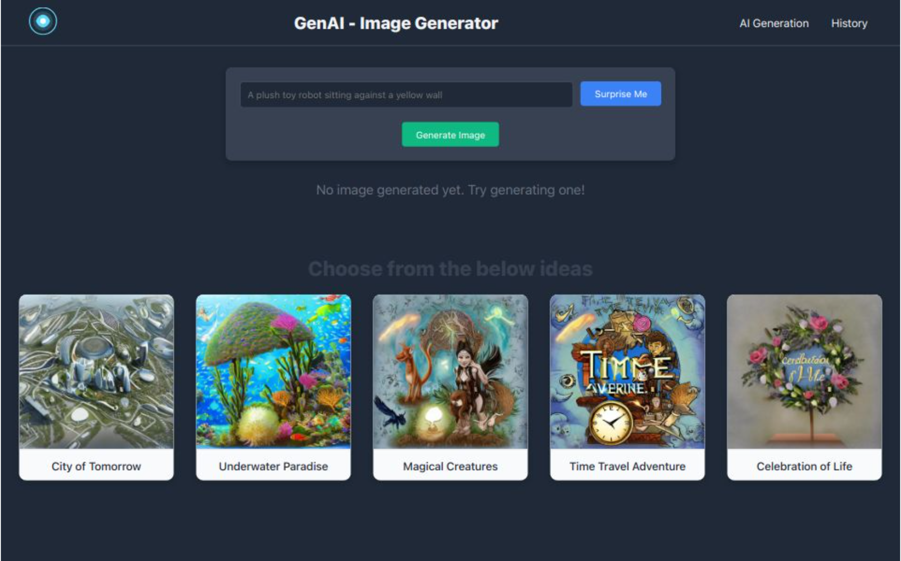

## Simple React App to Demonstrate GenAI Text2Image APIs Powered by SegMind

### [Live Demo](https://aiimage-blue.vercel.app/home)

### [GitHub Repository](https://github.com/Nishantvidhuri/Aiimage)

---

## Features:
1. **Generate Images:** Create images from text prompts with various parameters.
2. **Surprise Me:** Get instant inspiration with randomized prompts.
3. **Pick from Favorites:** Choose from a curated list of previously generated images.
4. **Recent History:** View and reuse your recently generated images.
5. **Download Images:** Save the generated images to your device.
6. **Responsive Design:** Works seamlessly on devices of all sizes.

---

## Articles/Blogs:
- [Building a Generative AI Application in 2024](https://medium.com/bitsrc/building-a-generative-ai-application-in-2024-b318064a454b)
- [Create Your Own GenAI Image Generator App Like MidJourney or DALL-E 2](https://dev.to/techygeeky/create-your-own-genai-image-generator-app-like-midjourney-or-dalle-2-lej)

---

## Tools and Technologies:
1. **React Hooks:** Utilized to fetch SegMind Text2Image API (Create your own API from [SegMind](https://www.SegMind.com)).
2. **Deployment:** Hosted on Vercel.
3. **Local Storage:** Saves recent history for easy access.

---

## Further Development Scope:
1. Reverse the order of recent history images.
2. Create an image slideshow for the recent history section.
3. Build REST APIs to store and retrieve images on a server (e.g., Render, Vercel, MongoDB Atlas free tiers).
4. Add i18n localization using `react-i18next` for multilingual support.
5. Write unit tests using `@testing-library/react`.

---

## App Snapshot:

---

## Available Scripts

Inside the project directory, run the following commands:

### `npm install`
Run this once to install all necessary dependencies.

### `npm start`
Starts the app in development mode.

Open [http://localhost:3000](http://localhost:3000) to view the app in your browser. The page will reload when you make edits, and you may see lint errors in the console.
